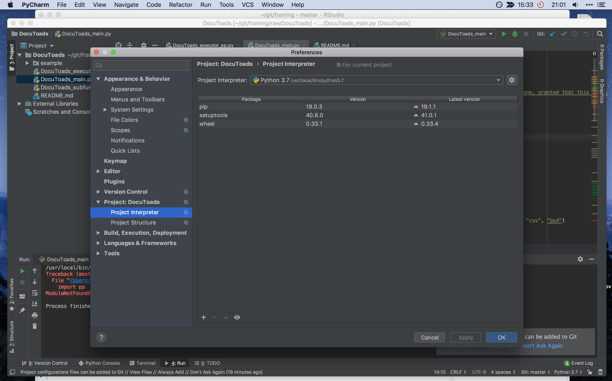

pycharm - IDE

- virtual environments for different project (f.e. running python 2.7)
- with anaconda
	- `conda create -n yourenvname python=2.7 anaconda`
	- call each time `conda activate yourenvname`
- `pip install packagename` - only installs in virtual environment; multiple versions in multiple envs possible
	- install multiple packages: `pip install pp os` 
- running code (from terminal): `python nameoffile`
- module = package
- library is where modules are stored
- specify library path before running the script so that it doesn't look in the wrong one
	- set it like this  
	- click on cogwheel (new, Python 2.7) 

- define new line like this `caselist = [
    'example/1751_1.txt', 'example/1751_2.txt', 'example_pre_draft', 'example_draft', 'example_case_id',\
] # Define up list of cases. Each row should contain (as strings): path to text 1, path to text 2, short name for text 1, short name for text 2, short name for case`
	- ---> no, we need a list of lists!

```
# Provide caselist
caselist = [
    ['example/1751_1.txt', 'example/1751_2.txt', 'example_pre_draft', 'example_draft', 'example_case_id', 'artname1', 'artname2']
] # Define up list of cases. Each row should contain (as strings): path to text 1, path to text 2, short name for text 1, short name for text 2, short name for case
```

- make big comments using ``` and ```
- the output in `outdocs.csv`
	- case name
	- length of text 1
	- length of text 2
	- matches
	- additions
	- substitutions
	- transposes
	- deletions
	- `textartindex1`
	- `textartindex2`
	- `lentex1`
	- `lentex2`
- matches, additions, substitions, transpositions, deletions
- `propname` = name of first text
- `legname` = name of second text
- `backtrace.csv`
	- what happens at which row of
	- row, row, 